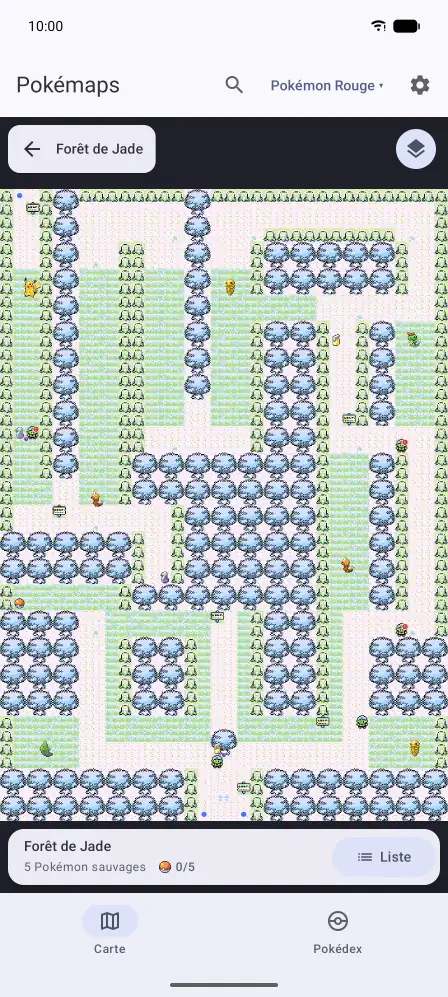
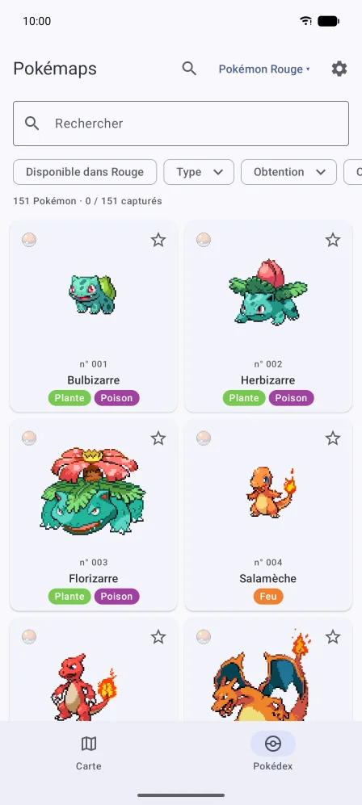
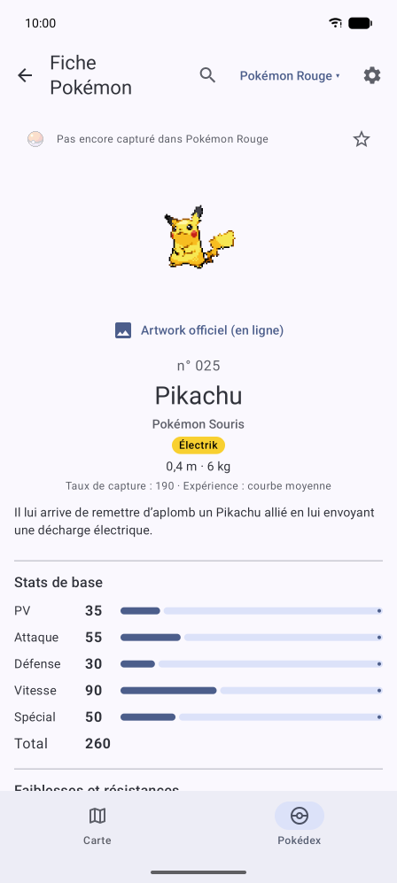
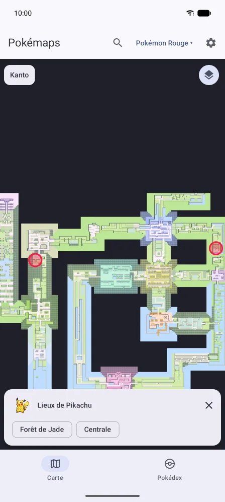
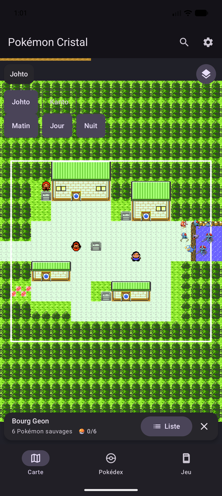

# Pokémaps

Application Android de **cartes interactives pour Pokémon Rouge, Bleu, Jaune, Or, Argent et Cristal**, en français :
cartes de Kanto et de Johto, Pokémon de chaque lieu, fiches Pokémon (évolutions, attaques, CT/CS, chromatique), fiches des
attaques (effet et probabilité de l'effet) et Pokédex.

- Kotlin + Jetpack Compose, **Android 17 (API 37) minimum**
- **Aucun service Google Play** : l'application fonctionne sur GrapheneOS
- Cartes, Pokédex, guides et listes de succès entièrement hors ligne : toutes leurs données sont embarquées.
  Une connexion RetroAchievements facultative lit la progression du compte, uniquement sur demande dans les Réglages.
- Identifiant de l'application : `org.opensources.pokmaps`

Le jeu se choisit dans l'onglet « Jeu » de la barre du bas, classé par génération, et reste mémorisé. Dans les
Réglages, « Captures comptées » fait compter un Pokémon capturé pour le jeu choisi, pour sa génération ou pour tous
les jeux ; chaque capture reste mémorisée dans le jeu où elle a été cochée, si bien que changer ce réglage ne perd
rien.

L'onglet « Guides » rassemble les étapes de la soluce, quêtes annexes, astuces, bugs et succès du jeu choisi.
Les guides se lisent sans case de fin de lecture ni liens de sources. Dojo et fossiles, Lugia et Ho-Oh ont chacun
leur article. Or, Argent et Cristal ajoutent les événements hebdomadaires, un vérificateur de reproduction
(sexes, groupes d'œufs, DV et héritage des attaques), avec recherche des parents par nom ou numéro, et un calculateur
de gains de bonheur. Le premier parent se choisit dans une fenêtre avec numéros, sprites et recherche ; le second
est proposé automatiquement (même espèce de sexe opposé, sinon Métamorph ou un partenaire compatible).
La liste du second parent contient uniquement les partenaires compatibles selon les groupes d’œufs et le sexe,
avec les exceptions pour Métamorph et les Pokémon sans sexe. Les espèces stériles affichent un avertissement.
Le sprite à droite ouvre la fiche,
et le résultat affiche aussi le sprite du Pokémon qui éclora. Les noms dans les textes ouvrent des fiches compactes
reliées au Pokédex et à la carte.
Les sprites et leur réglage d'animation sont réutilisés. Les chapitres proposent les succès liés, en signalant
les objectifs manquables avant de poursuivre.

Les 519 succès officiels sont un instantané traduit en français du 8 octobre 2026 : Rouge (93), Bleu (90),
Jaune (76), Or (72), Argent (75) et Cristal (113). Sans connexion configurée, les cases et le compteur suivent les
validations manuelles locales. Avec une connexion configurée, seuls le compteur RetroAchievements et les succès
synchronisés sont affichés ; les coches manuelles sont conservées pour une déconnexion ultérieure.
Le compteur de captures utilise uniquement les captures de la version choisie ; les objectifs
de collection utilisent leur véritable objectif (124, 124, 129, 199, 199 ou 206) et excluent les espèces nécessitant
un échange externe ou un événement externe. Les choix de Pokémon de départ, de fossile, du Dojo, d'évolution
d'Évoli en génération 1 et de pierres élémentaires limitées dans Or/Argent sont comptés par alternative,
sans additionner des branches incompatibles. Les autres restrictions du succès restent à respecter dans le jeu.
Les textes ne constituent pas une lecture de la sauvegarde de l'émulateur.

Dans les Réglages, renseigner le nom d'utilisateur et la **clé API web** RetroAchievements, enregistrer puis
choisir « Synchroniser ». Seul l'endpoint GET
[`API_GetGameInfoAndUserProgress.php`](https://api-docs.retroachievements.org/v1/get-game-info-and-user-progress.html)
est appelé, une fois par jeu ; aucun succès ni compte n'est modifié. Aucune requête ne part au lancement ou
lors du choix d'un jeu. Les résultats acquis et hardcore restent disponibles hors ligne ; un échec de lecture
conserve la dernière synchronisation. La clé est chiffrée avec Android Keystore dans `noBackupFilesDir`, sans
trace dans les journaux ni export. « Déconnecter » supprime la connexion et son cache, sans toucher au suivi manuel.
Sur GrapheneOS, autoriser « Network » dans les permissions de Pokémaps pour cette connexion.
La permission Internet sert à cette option ; les cartes et le Pokédex n'utilisent aucune API réseau.

« Sauvegarde de collection » exporte un JSON `pokmaps-collection`, schéma 1, avec captures par version, favoris,
formes de Zarbi, étapes cochées et observations des Pokémon errants. L'import valide le document entier (taille maximale 1 Mo)
avant une fusion atomique : captures, favoris et étapes sont réunis ; une observation importée remplace celle du
même Pokémon. Les autres réglages et les identifiants RetroAchievements sont exclus. Le sélecteur de documents
Android choisit le fichier, sans permission de stockage générale.

Pour ajouter ou retirer un guide : modifier les définitions de `data/guide/` et les textes français de
`res/values/strings.xml`. Les listes de succès sont séparées par jeu, avec identifiant officiel, points,
caractère manquable et chapitre associé. Les balises `[[pokemon:25|Pikachu]]`, `[[place:route-1|Route 1]]`,
`[[item:potion|Potion]]` et `[[character:oaks-lab:Prof. Chen|Professeur Chen]]` sont validées au chargement.
Les autres noms reconnus dans la base deviennent aussi des liens. `GuideRepositoryTest` charge les six bibliothèques
contre la base générée et vérifie leurs liens et nombres de succès. Les soluces sont des textes originaux ;
leurs sources éditoriales et les désassemblages pret restent documentés dans les définitions du dépôt.

Or, Argent et Cristal proposent Johto et Kanto via un menu de région en haut à gauche.
Dans les six jeux, les badges à droite permettent de changer d'étage. Les zones et salles d'un même niveau
s'affichent ensemble sur un plan. Chaque paire de passages reliés porte la même couleur ; les traits sont masqués
par défaut et le switch « Liaisons », présent sur les plans concernés, permet de les afficher dans ces couleurs.
Les maisons restent séparées, accessibles par leurs portes ; le Parc Safari réunit ainsi ses quatre zones.
Les assemblages et leurs positions sont relus dans `tools/data/map_plans.csv` (coordonnées en cases de 16 pixels).
Les passages viennent de pret ; les niveaux sans numéro explicite sont vérifiés dans les plans de
[L'Océane](https://bulbapedia.bulbagarden.net/wiki/S.S._Anne) et du
[Souterrain de Doublonville](https://bulbapedia.bulbagarden.net/wiki/Goldenrod_Tunnel).
Le Léviator fixe du Lac Colère utilise son sprite chromatique.
Le bouton à droite défile Matin, Jour, Nuit et Tout : il filtre les rencontres et anime la lumière ;
Tout conserve les couleurs originales. La liste du lieu a son propre filtre et regroupe les
rencontres identiques sur toute la journée sous « Tout le temps ».
Le filtre « Baies et Noigrumes » affiche les fruits correspondant à chaque arbre, avec leur sprite d'objet.
Le Pokédex des formes capturées de Zarbi est accessible depuis sa fiche.

La [documentation complète](docs/README.md) est organisée par fonctionnalité et génération.
Le [catalogue de provenance des sprites](docs/donnees/sprites-pokemon.md) couvre les 1 025 espèces
de la source épinglée, y compris celles des jeux à venir.

Les fiches d'Or et d'Argent affichent les six statistiques, les objets tenus, le sexe, les groupes d'œufs,
les cycles d'éclosion et les attaques par œuf. Les évolutions précisent le bonheur, l'heure et les objets tenus.
Le calculateur de capture reproduit la formule et les Balls du jeu, avec ses défauts d'origine ; le niveau du
Pokémon de l'équipe, la pêche et le contexte de la Love Ball sont réglables. Cristal ajoute ses cartes (Tour de Combat,
salles des Ruines d'Alpha, Sanctuaire du Dragon), ses rencontres et échanges, les sept possibilités de l'œuf de la
Pension, Suicune à la Tour Ferraille et les attaques par tuteur. Le tuteur coûte 4 000 jetons ; les récompenses de
Buena affichent leur prix en points de la Carte Bleue.

Le menu des régions distingue la région sélectionnée. En deuxième génération, le bouton de la carte affiche
une icône animée au changement de moment (matin, jour, nuit ou tout). La liste des Pokémon d'une route ou d'un
bâtiment reprend ce choix à l'ouverture ; ses filtres de moment et de capture (tout, marche, pêche, surf)
restent locaux à la liste. Les points de Kanto retouchés en première génération sont repris en deuxième
génération lorsqu'ils correspondent encore au même terrain, avec des emplacements supplémentaires au besoin.

Les filtres de capture apparaissent seulement si la méthode possède des rencontres au moment choisi.
Une liste sans Pokémon ne propose aucun filtre. Les icônes matin, jour et nuit utilisent les dessins
Meteocons de Bas Milius, adaptés en vecteurs Android (version 3.0.0-next.10, style Flat, licence MIT
embarquée dans `app/src/main/assets/licenses/meteocons.txt`).

## Captures d'écran

| Carte et Pokémon sauvages | Pokédex | Fiche Pokémon | Lieux d'un Pokémon |
|---|---|---|---|
|  |  |  |  |

Pokémon Rouge, sur l'émulateur Android 17 (Pixel 9 Pro XL).

| Carte de Johto dans Pokémon Cristal |
|---|
|  |

Pokémon Cristal, sur le même émulateur Android 17 (Pixel 9 Pro XL).

## Structure

| Dossier | Contenu |
|---|---|
| `app/` | Application Android |
| `tools/` | Pipeline de données Python : génère la base `pokedex.db` et les images |
| `tools/data/` | Corrections relues à la main (noms français, notes, doublons) |
| `docs/screenshots/` | Captures d'écran du README |
| `.github/` | CI/CD (GitHub Actions) |

## Données

`tools/build_data.py` génère, dans `app/src/main/assets/` :

- `database/pokedex.db` : la base SQLite de l'application ;
- `sprites/` : sprites des Pokémon (un seul style partout, animé ou fixe, normal ou chromatique) et icônes
  d'objets ;
- `maps/` : cartes pixel-art de chaque jeu découpées en tuiles (cartes du monde de Kanto et de Johto et lieux à part),
  et sprites des PNJ.

Les jeux en cours d'intégration (`GAMES_IN_PROGRESS` dans `tools/pokemaps_data/games.py`, actuellement vide)
ne sont pas embarqués : `tools/build_data.py` les génère avec tous les autres dans un aperçu,
`tools/build/preview/` (même organisation, hors de Git), validé de la même façon. Les tests du pipeline et l'éditeur des
emplacements le lisent.

Toutes les images sont embarquées en WebP sans perte, plus léger que PNG et GIF à pixels identiques ; chaque
image convertie est relue et comparée à sa source, et la génération s'arrête si elle diffère.

Sources (les mêmes que [pokemaps.net](https://pokemaps.net)) :

- **[PokéAPI](https://pokeapi.co)**, via l'export CSV du dépôt [PokeAPI/pokeapi](https://github.com/PokeAPI/pokeapi) :
  Pokémon, noms et descriptions en français, types et stats par génération, attaques par jeu, évolutions, Pokédex,
  lieux et rencontres de chaque version ; objets tenus, groupes d'œufs et talents, préparés pour les générations
  suivantes (vides en 1re génération). Les CSV sont téléchargés lors d'une génération explicite, avec cache ;
  l'application n'appelle jamais l'API ([usage équitable](https://pokeapi.co/docs/v2#fairuse)).
- **[pokesprite](https://github.com/msikma/pokesprite)** : icônes d'objets.
- **[PokeAPI/sprites](https://github.com/PokeAPI/sprites)** : sprites animés de Noir/Blanc, normaux et chromatiques,
  seul style de sprite des Pokémon (carte, listes, fiches, Pokédex, évolutions, jaquettes dessinées de l'écran de
  choix du jeu). Le sprite fixe est la première image du sprite animé : même
  dessin, même taille. Les Réglages choisissent, endroit par endroit, où ils sont animés. Ces sprites n'existent que
  pour les Pokémon n° 1 à 649 (5 premières générations) : la génération s'arrête si un jeu en demande d'autres.
- **[pret/pokered](https://github.com/pret/pokered)** et **[pret/pokeyellow](https://github.com/pret/pokeyellow)**
  (désassemblages des jeux) : pour dessiner les cartes, à partir des blocs, tilesets, palettes Super Game Boy,
  connexions, warps, objets et PNJ, et ce que proposent les personnages (soins, boutiques, dons, échanges,
  lots du Casino et leur prix en jetons, distributeurs, fossiles ranimés) ; pour l'effet de chaque attaque, tel que
  le moteur de combat l'exécute (`data/moves/moves.asm`). Aucune ROM n'est utilisée.
- **[pret/pokegold](https://github.com/pret/pokegold)** (Or et Argent) et
  **[pret/pokecrystal](https://github.com/pret/pokecrystal)** (Cristal) : cartes de Johto et de Kanto, et rencontres
  aléatoires lues comme le moteur les tire (herbes et grottes par moment de la journée, surf, pêche, Coup d'Boule,
  Éclate-Roc, essaims, Concours de capture d'insectes, `data/wild/`), PokéAPI les décrivant mal pour ces jeux
  (moments de la journée perdus, emplacements d'essaim manquants) ; dons, Pokémon fixes et échanges restent ceux de
  PokéAPI.
- **`tools/data/`** : quelques corrections et compléments relus à la main (accents, étages mal nommés,
  prix du Casino, Pokémon demandés en échange, doublons), noms français des cartes (`maps.csv`), des classes de
  dresseurs (`trainer_classes.csv`), des personnages et leur apparence (`npc_names.csv`, `npc_text_names.csv`) et
  des installations (`facility_names.csv`), lien entre cartes et zones de rencontre PokéAPI, par famille de cartes
  (`map_areas.csv`), zones et objets absents de PokéAPI (`extra_areas.csv`, `extra_items.csv` : l'ADN Berzerk
  et les lettres d'Or et d'Argent), Pokémon qu'un jeu n'obtient que par échange avec un autre (`transfer_only.csv`),
  personnages en double écartés (`npc_duplicates.csv` : un même personnage à plusieurs étapes du scénario), offres
  que les scripts ne disent pas simplement (`npc_offers.csv`, action `add` : échanges d'objets, jetons vendus,
  Pokémon de départ du labo du Prof. Chen, Balls de Fargas ; action `remove` : don qu'un autre personnage fait
  pendant la scène), texte de l'effet de chaque attaque (`move_effects.csv`, une ligne par effet du moteur ou par
  attaque particulière, avec sa probabilité en chances sur 256 relevée dans `engine/battle/effects.asm`) et placement
  des cartes là où les connexions ne suffisent pas : cartes ancrées dans une carte du monde (`map_anchors.csv`),
  connexions incohérentes écartées (`map_connection_skips.csv`) et ville ou route d'origine d'une carte atteinte de
  plusieurs côtés (`map_parents.csv`), et sens des drapeaux du scénario qu'exigent les offres
  (`story_events.csv`, voir ci-dessous).

Les objets temporaires sans position fixe sont aussi écartés dans `npc_duplicates.csv` : le sbire des caméras
du repaire Rocket est masqué à l'entrée, puis déplacé par chaque alarme ; sa position initiale dans le mur
n'est jamais affichée par le jeu.

Chaque offre de personnage dit aussi quand elle est possible : moments de la journée, jours de la semaine et étapes
du scénario. Ces conditions sont lues dans les scripts pret par une analyse de flot (`offer_conditions.py`,
`pret_conditions.py` pour Rouge, Bleu et Jaune, `pret_gen2_conditions.py` et `pret_gen2_presence.py` pour la 2e
génération) : une offre n'exige que ce qu'exigent tous les chemins du script qui y mènent, avec la présence du
personnage (moments de son object_event, rappels de la carte selon le jour ou le moment, drapeau qui le cache,
objets masqués au départ de la 1re génération, table de textes choisie par le script de la carte). Les tests faits
dans les routines du moteur (`engine/`), hors des scripts de carte, ne sont pas lus : l'hôtesse du Club Link de la
1re génération attend le Pokédex sans que l'application le dise. Le nom d'un drapeau ne suffit pas à dire ce qu'il
signifie (`EVENT_MET_BILL` est levé au début de Cristal et baissé quand on rencontre Léo) : `story_events.csv`
donne, pour chaque drapeau rencontré, la phrase à afficher quand il est levé ou baissé (vide s'il ne s'agit pas
d'une étape : drapeau du jour, appel téléphonique, détail de scène) et l'endroit de pret qui le change. Un drapeau
absent du fichier, une ligne inutilisée ou une offre jamais possible arrêtent la génération ; une offre que le jeu
ne permet jamais se retire dans `npc_offers.csv` (la CT12 de l'institutrice du passage, dans Cristal).

Les sources sont figées sur des commits précis (`tools/pokemaps_data/sources.py`), la génération est donc
reproductible. La base est vérifiée après chaque génération (références cohérentes, probabilités de rencontre
qui totalisent 100 % pour chaque moment de la journée, chaque Pokémon obtenable par rencontre, évolution ou
reproduction…).

### Ajouter un jeu

Les jeux pris en charge sont listés dans `tools/pokemaps_data/games.py`. Ajouter un jeu demande :

- une ligne dans `games.py`, d'abord dans `GAMES_IN_PROGRESS` (le jeu est généré et validé dans l'aperçu sans entrer
  dans l'application), puis dans `GAMES` quand l'application sait l'afficher : Pokémon, attaques, objets et
  rencontres sont alors extraits de PokéAPI (avec les
  symboles pret qui distinguent ses versions, comme `_RED` et `_BLUE` pour les lots du Casino), et la jaquette de
  chaque version (`VersionCover` : Pokémon de la jaquette et couleur) ;
- une source de sprites pour ses Pokémon au-delà du n° 649 (`sprites.py`), s'il en a ;
- de nommer ses nouvelles classes de dresseurs et ses nouveaux personnages dans `tools/data/` (un nom
  manquant arrête la génération) ;
- de choisir ou d'adapter son lecteur pret (`PretFormat`, `pret*.py`, `pret_gen2*.py`), ses régions et villes
  de départ (`Game.regions`), ses palettes et son rendu (`maps_render*.py`) ;
- de vérifier ses variantes de format même s’il partage un lecteur : Cristal ajoute une seconde banque
  de tuiles, des scripts conditionnels et `warpfacing`, ainsi que des tables sauvages `map_id` ;
- de lire et valider ses nouvelles offres (ex. tuteur payé en jetons et récompenses de Buena payées en
  points), puis de les représenter dans les modèles du domaine et les ressources françaises ;
- de classer ses nouvelles méthodes de rencontre (ex. `headbutt`) dans `ObtainMethod` : une méthode inconnue
  fait échouer le chargement au lieu de disparaître en silence des filtres et de la carte ;
- de lire les effets de ses attaques (`pret_moves.py`, `pret_gen2_moves.py` et `move_effects.csv`) : une
  attaque sans effet arrête la génération.

Les mécaniques propres aux générations suivantes sont prévues, et la fiche d'un Pokémon les affiche dès qu'un jeu les
connaît (`GenerationFeature` dans l'application) : objets tenus (2e génération ; PokéAPI ne les donne qu'à partir de la
3e, ceux de la 2e sont lus dans pret), chromatiques (1 chance sur 8 192, puis 1 sur 4 096 à partir
de la 6e génération), sexe, groupes d'œufs et cycles d'éclosion (2e génération) et talents, dont le talent caché
(3e et 5e générations). `tools/tests/test_future_generations.py` vérifie ces tables sur des jeux plus récents.

Les ressources finales de `app/src/main/assets/` sont versionnées avec Git classique, sans Git LFS :
base, sprites fixes et animés (normaux, chromatiques et formes de Zarbi), icônes d'objets, tuiles, sprites de PNJ
et licences. `assets.sha256` inventorie leurs chemins et empreintes. Les guides, succès traduits et vecteurs
Meteocons sont déjà conservés dans les sources Kotlin et ressources Android du dépôt.
Les caches, sources brutes et aperçus restent ignorés. Aucun build Android ne télécharge de contenu Pokémon.

## Éditeur des emplacements sauvages

Après une génération des données, lancer `python tools/map_editor.py` sur le PC. Tant que des jeux sont en cours
d'intégration, l'éditeur lit l'aperçu de tous les jeux (`tools/build/preview/`), sinon les assets de l'application.
Choisir les jeux (Rouge, Bleu et Jaune sont édités ensemble), la région (Johto ou Kanto pour Or et Argent ; un
bâtiment est rangé dans la région de la ville ou route d'où l'on y entre), la route ou le lieu, puis le terrain :
herbes ou sol pour la marche, eau pour le surf et la pêche, arbres pour Coup d'Boule et rochers pour Éclate-Roc (2e
génération). Seuls les lieux qui ont des rencontres sauvages sont proposés, et seuls les terrains où le jeu fait apparaître un
Pokémon : les herbes si la carte en a, le sol uniquement dans les grottes et bâtiments (pas dehors, ni dans la forêt de
Jade ou le Parc Safari, où la marche ne compte que dans les herbes), l'eau s'il y a du surf ou de la pêche, les arbres et
rochers seulement dans les cartes où le jeu en fait tomber ou surgir des Pokémon. La génération
applique la même règle et refuse dans `map_spots.csv` un terrain où aucun Pokémon ne peut apparaître. La liste affiche les
Pokémon à placer sur ce terrain, avec leur version, leurs niveaux et leur probabilité. Cliquer sur la carte ajoute un
emplacement, centré sur la case de 16 px ; cliquer sur un emplacement le retire. « Vider ce terrain » retire tous ses
emplacements.

« Carte affichée » permet de basculer entre Rouge/Bleu et Jaune, ou entre Or/Argent et Cristal. Le plan,
les rencontres et les calques suivent ce choix. La case « Points uniquement pour … » est cochée automatiquement
pour le groupe affiché : les ajouts et retraits ne concernent que ce groupe. La décocher permet de retoucher
les emplacements communs à la famille. Lors de la première retouche propre à un groupe, les points communs
servent de départ ; la liste obtenue remplace ensuite les points communs pour ce terrain dans ce groupe.
Les modifications restent en attente pendant les changements de carte.

Les coordonnées du curseur et du centre de la case survolée s'affichent en bas à droite. Les boutons « + »,
« − » et la molette permettent de zoomer et dézoomer ; « Ajuster » remet la carte à la taille de la fenêtre.
Glisser avec le bouton droit déplace la carte agrandie. Les points invalides sont signalés en jaune avec « ! ».
La section « Erreurs à corriger » recense tous les problèmes : cliquer sur une erreur ouvre les jeux, le lieu
et le terrain concernés, puis centre la carte sur le point. « Retirer le point sélectionné » le supprime
des modifications en attente, même s'il est hors du lieu. Les corrections sont sauvegardées par
« Enregistrer toutes les cartes ». Le rapport local `tools/build/map_spot_errors.json` est actualisé
au démarrage, après chaque modification et lors de la validation ; aucune donnée n'est téléchargée.

Les cases « Afficher sur la carte » dessinent, à la taille de l'application, ce que la carte finale montre autour des
emplacements : entrées, objets et objets cachés, dresseurs, personnages et installations, Pokémon fixes. L'« aperçu des
Pokémon sauvages » (décoché par défaut) pose un sprite du terrain sur chaque emplacement pour juger la place qu'ils
prennent ; l'application, elle, choisit elle-même quel Pokémon va sur quel emplacement. L'éditeur lit les sources pret
déjà téléchargées dans `tools/.cache` par la génération.

Un avertissement apparaît quand un terrain a moins d'emplacements que de Pokémon à y dessiner (dans la version qui en
demande le plus) : l'application les rangerait alors en grille au milieu du terrain. L'enregistrement demande une
confirmation s'il reste de tels terrains.

Les positions peuvent être communes à tous les jeux d'une même famille de cartes (`map_family` dans
`tools/pokemaps_data/games.py`) : Or, Argent et Cristal ont leur propre famille, et leurs emplacements ne se
mélangent pas à ceux de Rouge, Bleu et Jaune. Seuls les terrains réellement modifiés sont écrits dans `tools/data/map_spots.csv`
(colonnes `family,map_identifier,kind,x,y`, puis `version_group` dès qu'un groupe est ciblé ; une valeur vide
conserve la portée commune, une ligne sans coordonnées marque un terrain vide) ; les autres restent
calculés par la génération. Le bouton « Enregistrer toutes les cartes » valide localement les terrains et les
coordonnées, puis écrit les modifications dans `tools/data/map_spots.csv`. Il ne lance aucune génération,
installation, aucun téléchargement ni test. Les clics hors du terrain choisi sont refusés ; les points doivent
appartenir à ce terrain dans les jeux ciblés qui contiennent le lieu. Les anciens points invalides
restent visibles pour pouvoir les retirer ; ils bloquent l'enregistrement avec un message indiquant le lieu
et les coordonnées. L'éditeur utilise la base, les images et les sources pret déjà présentes sur le PC.
Le sol des grottes tient compte des zones accessibles avec Surf, même si aucun chemin terrestre ne les relie
à l'entrée. Or/Argent et Cristal ont parfois des plans différents : les erreurs précisent les versions qui
refusent la case, et le choix « Carte affichée » permet d'examiner les deux plans.
Pour intégrer ensuite les emplacements dans l'application, lancer explicitement `python tools/build_data.py`
puis les contrôles décrits ci-dessous.

## Compiler en local

Prérequis : Android SDK (API 37), git, et un JDK pour lancer `gradlew`. Python est nécessaire seulement
pour les contrôles Python et la mise à jour explicite des données.

Gradle exécute toujours la build sur **Temurin 21**, le JDK de la CI, quel que soit le JDK qui lance `gradlew`
(celui d'Android Studio, par exemple) : `gradle/gradle-daemon-jvm.properties` fixe ce critère et Gradle télécharge
ce JDK une fois s'il n'est pas installé. Sur un JDK 24 ou plus récent, ktlint (compilateur Kotlin embarqué) et le
protobuf de DataStore dans les tests JVM appellent `sun.misc.Unsafe`, que ces JDK signalent par un avertissement.

```bash
# Compiler et installer avec les assets du dépôt, sans tools/.cache
./gradlew installDebug
```

Vérifications lancées par la CI :

```bash
./gradlew ktlintCheck checkNoGoogleServices lintDebug testDebugUnitTest   # Android (tests UI compris)
./gradlew ktlintFormat                                                    # corrige le style Kotlin

cd tools
pip install -r requirements-dev.txt
ruff check . && ruff format --check .   # style Python
python -m pytest                        # tests sans cache ni téléchargement de contenu
```

`./gradlew checkAssets` vérifie chaque fichier de l'inventaire et son SHA-256 ; ce contrôle précède
la compilation et les tests JVM. Un fichier absent ou modifié provoque une erreur qui nomme le fichier.
`python tools/check_assets.py` vérifie aussi les références aux images et la cohérence de la base.
Ces commandes utilisent uniquement les ressources finales du dépôt, même si `tools/.cache` est absent et
les sources de contenu Pokémon sont hors ligne. Les outils Android, JDK et dépendances de compilation
peuvent toujours nécessiter un téléchargement.

### Mettre à jour les données

Exécuter la génération seulement pour modifier des données, des corrections éditoriales ou ajouter du contenu :

```bash
pip install -r tools/requirements-dev.txt
python tools/build_data.py
python tools/check_assets.py
cd tools
ruff check . && ruff format --check .
python -m pytest -q
python -m pytest -q -m pipeline
```

La génération réutilise les CSV, désassemblages, images et conversions déjà présents dans `tools/.cache` ;
elle ne télécharge que les sources manquantes aux commits épinglés. Les tests bloquent les accès réseau.
Les tests `pipeline` lisent ces sources et restent séparés des contrôles ordinaires ; ils sont exclus par défaut.
Relire puis versionner ensemble les changements éditoriaux, scripts concernés et assets finaux, y compris
`assets.sha256`. Ne pas ajouter `tools/.cache`, `tools/build/preview` ni les fichiers temporaires à Git.

Les tests UI Compose tournent sur la JVM avec Robolectric, dans `testDebugUnitTest` : ni appareil ni émulateur.
Ils parcourent l'application complète sur la base générée (Pokédex → fiche → carte, recherche → lieu ou objet,
choix du jeu, réglages) ; une base versionnée absente fait échouer les contrôles.

`checkNoGoogleServices` fait échouer la build si une dépendance tire les services Google Play
(`com.google.android.gms`), Firebase ou Play Core.

### Dépendances et notes de version

`.\gradlew.bat dependencyUpdates` liste les versions stables disponibles sans modifier le
catalogue. Toute mise à jour reste manuelle et doit être vérifiée avec les contrôles du projet.

Seul avertissement restant : `Configuration.setVisible(boolean) method has been deprecated`, à la configuration
du projet. Il vient d'AGP lui-même (`BasePlugin` et `SourceSetManager`, appelés à l'application du plugin), pas
de notre build : Gradle le déprécie depuis la 9.1, AGP 9.4.1 exige Gradle 9.6 ou plus récent, et AGP 9.5.0-alpha08
l'appelle encore. Il reste affiché (`org.gradle.warning.mode=all`) ; vérifier sa disparition à chaque montée d'AGP,
et monter AGP avant que Gradle 11 ne retire la méthode.

Pour une prochaine release, ajouter une ligne française sous le marqueur `<!-- notes -->` dans
[`RELEASE_NOTES.md`](RELEASE_NOTES.md). Le workflow inclut ces notes dans la GitHub Release et,
après publication réussie, vide la liste dans un commit sur `main`. Si `main` contient déjà des
notes différentes de celles du tag, elles sont conservées pour la release suivante.

## CI/CD

- **CI** (`.github/workflows/ci.yml`), à chaque push et pull request : validation des assets versionnés, tests sans sources,
  ktlint, vérification sans Google Play, Android Lint, tests unitaires et APK debug
  (téléchargeable dans les artefacts du workflow pendant 14 jours).
- **Release** (`.github/workflows/release.yml`), à chaque tag `vX.Y.Z` : APK release signé publié dans
  [GitHub Releases](../../releases), avec son empreinte SHA-256.

Les workflows CI et release utilisent les assets du checkout : aucune génération, aucun cache de contenu
et aucun téléchargement de sources Pokémon. Le résumé indique la taille exacte de l'APK produit.
Le workflow manuel `data-pipeline.yml` génère et teste séparément les données depuis les sources épinglées,
avec cache ; il ne publie rien et ne remplace pas la mise à jour locale des assets à versionner.

Mesure locale du 8 octobre 2026, avec les six versions et les sources déjà en cache : génération et validation
en 50,7 s ; APK debug de 62 760 138 octets (59,85 Mio). Les cartes représentent 5 903 Kio pour 5 732 tuiles.
Ces mesures Windows ne prédisent pas la durée d'un premier téléchargement ni la taille de l'APK release.

Les téléchargements HTTP réessaient jusqu'à quatre fois en cas de coupure réseau, de délai dépassé ou de réponse
HTTP temporaire (408, 429, 500, 502, 503, 504), avec des pauses de 1, 2 puis 4 secondes. Les fichiers incomplets
sont supprimés à chaque échec ; un échec persistant arrête la génération en indiquant l'URL concernée.

### Publier une version

**Une seule fois** : créer la clé de signature et l'ajouter aux secrets du dépôt.

```bash
keytool -genkeypair -v -keystore pokemaps-release.jks -alias pokemaps \
  -keyalg RSA -keysize 4096 -validity 10000
base64 -w 0 pokemaps-release.jks > pokemaps-release.jks.base64
```

Dans GitHub, *Settings → Secrets and variables → Actions → New repository secret* :

| Secret | Valeur |
|---|---|
| `KEYSTORE_BASE64` | contenu de `pokemaps-release.jks.base64` |
| `KEYSTORE_PASSWORD` | mot de passe du keystore |
| `KEY_ALIAS` | `pokemaps` |
| `KEY_PASSWORD` | mot de passe de la clé |

⚠️ Conservez `pokemaps-release.jks` et ses mots de passe en lieu sûr, **hors du dépôt** : sans eux, il est
impossible de publier une mise à jour installable par-dessus l'application existante.

**À chaque version**, vérifier que les assets finaux et leur inventaire font partie du commit à publier.
Une mise à jour du code seule réutilise ces données sans les régénérer. Puis, au choix :

- pousser un tag :
  ```bash
  git tag v1.0.0
  git push origin v1.0.0
  ```
- ou, dans GitHub, *Actions → Release → Run workflow* en indiquant la version (ex. `1.0.0`) : le tag est créé
  sur le dernier commit de la branche choisie.

Le code de version Android est calculé à partir du tag : `MAJEUR × 10000 + MINEUR × 100 + CORRECTIF`.

## Installer sur GrapheneOS (Obtainium)

[Obtainium](https://github.com/ImranR98/Obtainium) installe et met à jour les applications directement
depuis leurs GitHub Releases.

1. Installer Obtainium (depuis ses GitHub Releases ou F-Droid).
2. *Ajouter une application* → URL : `https://github.com/sargo22341-prog/pokmaps`.
3. Obtainium installe la dernière version et signale les mises à jour.

Sans Obtainium : télécharger l'APK depuis la page Releases et l'ouvrir sur le téléphone.

## Mentions légales

Projet de fan, personnel et non commercial. Pokémon et les noms associés sont des marques de Nintendo,
Game Freak et The Pokémon Company ; les images des Pokémon, des objets et des cartes sont © Nintendo, Creatures
et GAME FREAK. Ce dépôt ne contient aucune ROM ni ressource extraite d'une ROM.
Le code de l'application est sous licence [MIT](LICENSE).
